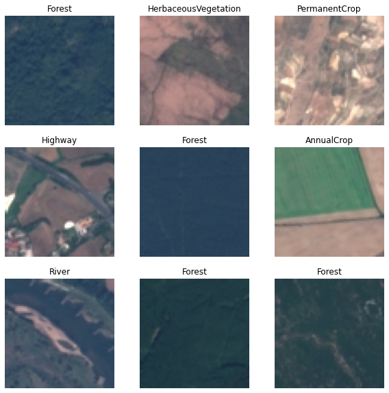
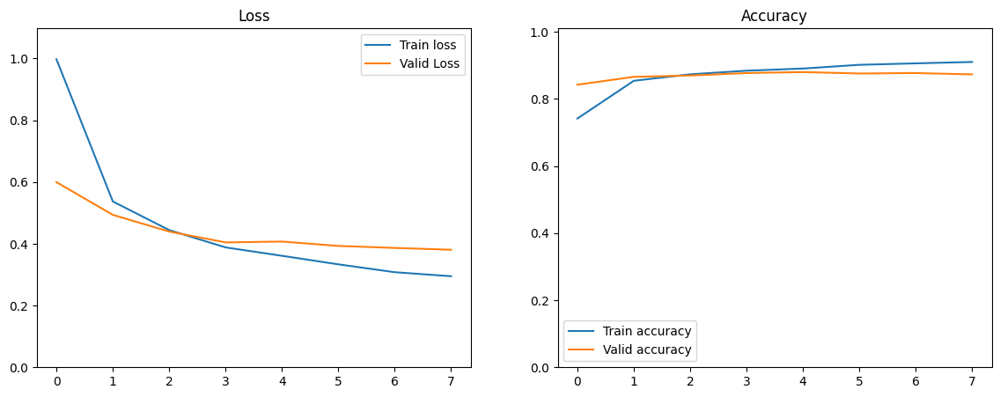

# Введение в нейронные сети: Классификация спутниковых изображений

Этот проект посвящен классификации спутниковых снимков на основе обученной модели ResNet50, с модификацией последнего полносвязного слоя.

## Описание проекта

### Датасет
Использовался набор данных [EuroSAT](https://www.kaggle.com/datasets/apollo2506/eurosat-dataset/data), состоящий из 27 000 изображений в 10 различных категориях земного покрова.  Изображения имеют размер 64x64 пикселя и получены со спутника Sentinel-2.

Проект Вы можете посмотреть по ссылке https://alexnetteam1.streamlit.app
